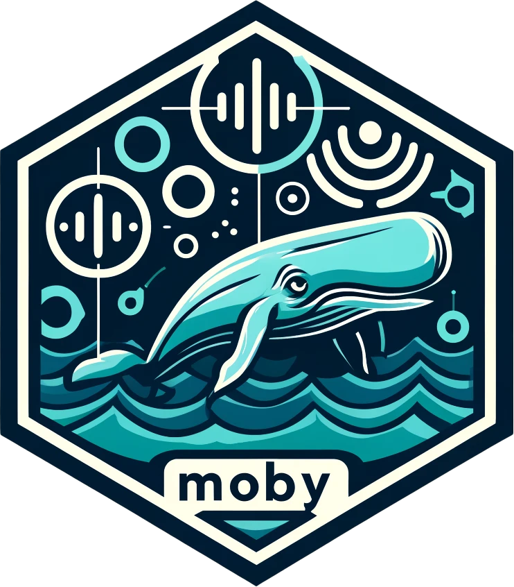

# moby 

[](https://www.repostatus.org/#active)
[](https://lifecycle.r-lib.org/articles/stages.html#experimental)
[](https://CRAN.R-project.org/package=moby)
[](https://github.com/miguelgandra/moby/actions/workflows/R-CMD-check.yaml)
[]()


**moby** is an R package designed for the analysis and visualization of passive acoustic telemetry data, primarily focused on marine environments. Acoustic passive telemetry has become an invaluable tool for studying the movement and behaviour of aquatic organisms in their natural habitats. However, the vast amounts of data generated pose unique analytical challenges.

The **moby** package offers a comprehensive suite of functions and methods tailored specifically for processing, visualizing, and interpreting passive acoustic telemetry data. Its user-friendly interface and wide range of analytical tools empower researchers to extract meaningful insights from their telemetry data, ultimately contributing to the advance of research and conservation efforts in marine ecosystems.


## Installation

You can install the development version of moby from GitHub with:

``` r
# install.packages("devtools")
devtools::install_github("miguelgandra/moby")
```

## Documentation

For detailed information on how to use moby, please refer to the package documentation.


## Feedback and Contributions
Even though **moby** has been thoroughly tested in-house, it's possible that new datasets and systems may present unforeseen issues. If you run into any problems or have suggestions for improvement, don’t hesitate to share them on GitHub! Contributions from the community are warmly welcome.

## License
This project is licensed under the GPL v3 license.
