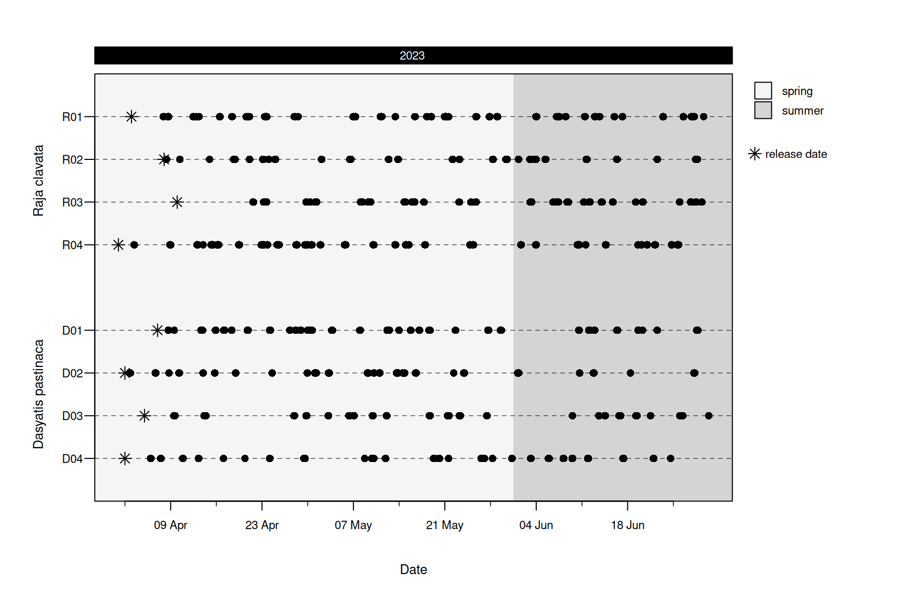
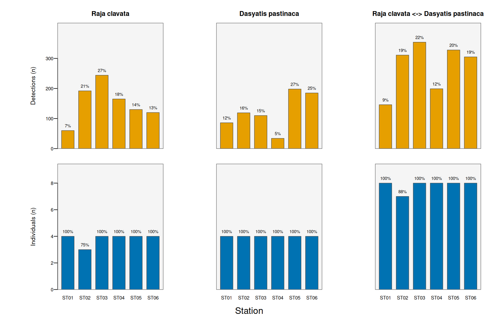
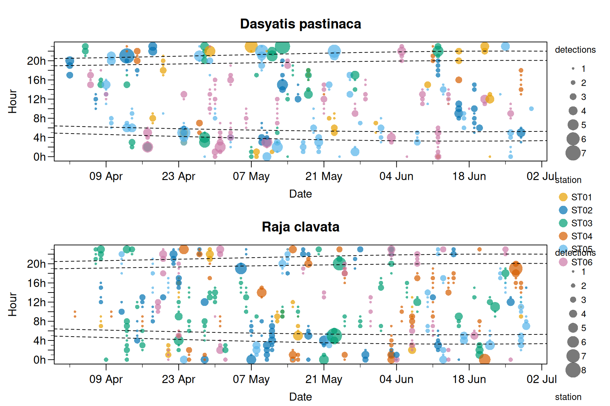
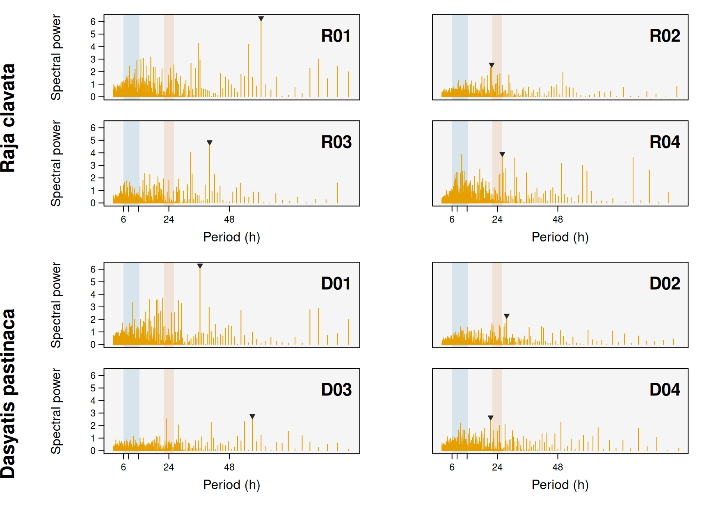
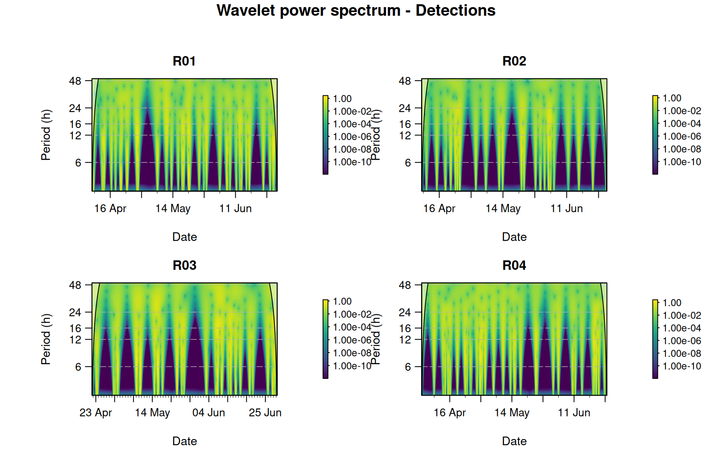

# 03 - Exploratory analysis

> **In this module**
>
> Starting from a clean `mobyData` checkpoint, you will visualise
> detection patterns, classify diel phases, quantify residency, and
> produce a publication-style summary table — **separately for each
> species** using a single `id.groups` object.
>
> **Prerequisites:** none. This module loads the bundled checkpoint
> `rays`, so you can run it without having completed modules 01–02.

## Learning objectives

By the end of this module you will be able to:

1.  Load the cleaned `mobyData` checkpoint and inspect its metadata.
2.  Use **`id.groups`** to generate every output per species
    automatically.
3.  Draw abacus, station-summary and chronogram plots.
4.  Classify detections by **diel phase** with
    [`getDielPhase()`](https://miguelgandra.github.io/moby/reference/getDielPhase.md).
5.  Reveal activity **rhythms** with
    [`plotPeriodogram()`](https://miguelgandra.github.io/moby/reference/plotPeriodogram.md)
    and
    [`plotScalogram()`](https://miguelgandra.github.io/moby/reference/plotScalogram.md).
6.  Compute **residency indices** with
    [`calculateResidency()`](https://miguelgandra.github.io/moby/reference/calculateResidency.md)
    and format them with
    [`summaryTable()`](https://miguelgandra.github.io/moby/reference/summaryTable.md).

## Setup

``` r

library(moby)

# the cleaned, analysis-ready checkpoint (a mobyData object: see ?rays)
data(rays)

# the two-species grouping is stored in the object's metadata
id_groups <- mobyMeta(rays)$id.groups
names(id_groups)
#> [1] "Raja clavata"       "Dasyatis pastinaca"
```

> **The `id.groups` motif**
>
> `id_groups` is a **named list of animal IDs, one element per
> species**. Passing it to a moby function tells that function to
> compute and lay out its results *independently for each group*. You
> will pass the same `id_groups` object to almost every function from
> here on — that is all it takes to get per-species outputs.

``` r

str(id_groups)
#> List of 2
#>  $ Raja clavata      : chr [1:4] "R01" "R02" "R03" "R04"
#>  $ Dasyatis pastinaca: chr [1:4] "D01" "D02" "D03" "D04"
```

## 1. A first look: the abacus plot

An *abacus plot* shows, for every individual, when it was detected over
the study period — the quickest way to eyeshot data coverage, gaps and
tag attrition.

``` r

plotAbacus(rays, id.groups = id_groups)
#> Warning: - 'id.col' converted to factor.
#> 
#> Abacus plot
#> ------------------------------------------------------
#>   Individuals:     8 (2 groups)
#>   Detections:      1,643
#>   Period:          2023-04-01 to 2023-06-30 (90 d)
#>   Points:          cex 1.00
#>   Date axis:       auto -> weekly ("%d %b")
#>   Top band:        "%Y"
#>   Shading:         seasonal
#>   Legend:          1 col
#> ------------------------------------------------------
```



## 2. Where were animals detected? Station summaries

Each statistic is drawn in its own panel with its own axis, so counts of
detections and of individuals are never conflated on a shared scale.
Columns split the animals by species.

``` r

plotStationStats(rays, type = c("detections", "individuals"), id.groups = id_groups)
#> Warning: - 'id.col' converted to factor.
#> Warning: - Converting 'station.col' to factor.
#> 
#> Station statistics
#> ------------------------------------------------------
#>   Statistics:      detections, individuals
#>   Aggregate:       station (6 levels)
#>   Individuals:     8
#>   Groups:          2 (all -> 3 series)
#>   Bar height:      counts (share for avg. detections)
#> ------------------------------------------------------
```



## 3. Diel patterns

Many coastal species shift activity between day and night. First we
classify every detection by **diel phase** (here a simple day/night
split based on the array’s location), then visualise the hour-by-date
structure with a chronogram.

``` r

# representative coordinates of the array (centre of the MPA)
mpa_coords <- matrix(c(mean(rays$lon), mean(rays$lat)), nrow = 1)

rays$diel <- getDielPhase(rays$datetime, coords = mpa_coords, phases = 2)
table(rays$diel)
#> 
#>   day night 
#>   799   844
```

``` r

# chronograms operate on time-binned detections; bin to the hour first
rays$timebin <- getTimeBins(rays$datetime, interval = "60 mins")

# one panel per species (split.by), points coloured by receiver
plotChronogram(rays, coords = mpa_coords, split.by = "species",
               color.by = "station")
#> Warning: - 'id.col' converted to factor.
#> Warning: - 'color.by' variable converted to factor.
#> 
#> Chronogram
#> ------------------------------------------------------
#>   Individuals:     8
#>   Detections:      1,643
#>   Period:          2023-04-02 to 2023-06-30 (88 d)
#>   Time bin:        60 min
#>   Metric:          detections
#>   Split by:        species (2 groups)
#>   Style:           points
#>   Colour:          station (categorical)
#>   Diel:            4 lines
#>   Date axis:       auto
#> ------------------------------------------------------
```



## 4. Activity rhythms

The chronogram *shows* diel structure;
[`plotPeriodogram()`](https://miguelgandra.github.io/moby/reference/plotPeriodogram.md)
and
[`plotScalogram()`](https://miguelgandra.github.io/moby/reference/plotScalogram.md)
*quantify* the periodicities in a detection time series. Both work on a
binned count series, so first collapse the detections into hourly counts
per individual (`rays$timebin` was created above).

``` r

# hourly detection counts per individual: a long ID x time-bin x count table
binned <- aggregate(list(detections = rep(1L, nrow(rays))),
                    by = list(ID = rays$ID, timebin = rays$timebin), FUN = sum)
```

A **periodogram** gives one global spectrum per animal — how much power
sits at each candidate period. The tidal (~6–12 h) and diel (~24 h)
bands are shaded and the dominant peak is marked.

``` r

plotPeriodogram(binned, id.col = "ID", timebin.col = "timebin", id.groups = id_groups)
#> Warning: - 'id.col' converted to factor.
#> 
#> Detection periodogram
#> ------------------------------------------------------
#>   Individuals:     8 of 8 (min.days filter)
#>   Sampling:        dt = 60 min
#>   Method:          FFT periodogram; detrend: none
#>   Period range:    2.0-96.0 h
#>   Dominant peak:   0 tidal, 1 diel, 7 other
#> ------------------------------------------------------
```



A **scalogram** (continuous wavelet transform) shows *when* each rhythm
is present — a time (x) by period (y) heat map. Shown here for the first
species:

``` r
plotScalogram(binned[binned$ID %in% id_groups[[1]], ],
              variable = "detections", id.col = "ID", timebin.col = "timebin", ncol = 2)
#> Warning: - 'id.col' converted to factor.
#> 
#> Wavelet scalogram
#> ------------------------------------------------------
#>   Individuals:     4 of 4 (min.days filter)
#>   Sampling:        dt = 60 min
#>   Wavelet:         MORLET; power: log
#>   Pre-processing:  gaps: zero; detrend: none
#>   Period range:    3-48 h
#> ------------------------------------------------------
#> 
  |                                                                            
  |                                                                      |   0%
  |                                                                            
  |==================                                                    |  25%
  |                                                                            
  |===================================                                   |  50%
  |                                                                            
  |====================================================                  |  75%
  |                                                                            
  |======================================================================| 100%
```



> **Note**
>
> For these simulated rays the strongest periodicities are multi-day
> presence bouts, with a weaker near-diel (~24 h) component. Real
> activity data with a clear circadian rhythm shows a sharp 24 h peak
> and a persistent diel band running across the scalogram.

## 5. Residency

[`calculateResidency()`](https://miguelgandra.github.io/moby/reference/calculateResidency.md)
returns a tidy, numeric table of residency indices (IR1, IR2, IWR) and
the building blocks they derive from. We supply the date monitoring
ended so the indices that need the full study interval can be computed.

``` r

monitoring_end <- as.POSIXct("2023-07-05", tz = "UTC")

residency <- calculateResidency(rays, last.monitoring.date = monitoring_end)
#> Warning: - 'id.col' converted to factor.
head(residency)
#>    ID tagging_date     first_detection      last_detection monitoring_end
#> 1 D01   2023-04-07 2023-04-08 15:05:10 2023-06-28 18:33:40     2023-07-05
#> 2 D02   2023-04-02 2023-04-02 17:11:13 2023-06-28 06:55:50     2023-07-05
#> 3 D03   2023-04-05 2023-04-09 11:28:11 2023-06-30 10:10:52     2023-07-05
#> 4 D04   2023-04-02 2023-04-05 21:58:36 2023-06-24 13:59:54     2023-07-05
#> 5 R01   2023-04-03 2023-04-07 20:38:30 2023-06-29 15:38:57     2023-07-05
#> 6 R02   2023-04-08 2023-04-08 07:08:58 2023-06-28 16:57:07     2023-07-05
#>   days_detected detection_span monitoring_duration       IR1       IR2
#> 1            31             83                  89 0.3734940 0.3483146
#> 2            25             88                  94 0.2840909 0.2659574
#> 3            24             87                  91 0.2758621 0.2637363
#> 4            30             84                  94 0.3571429 0.3191489
#> 5            38             88                  93 0.4318182 0.4086022
#> 6            23             82                  88 0.2804878 0.2613636
#>         IWR
#> 1 0.3248327
#> 2 0.2489814
#> 3 0.2521435
#> 4 0.2851969
#> 5 0.3866343
#> 6 0.2435434
```

## 6. A publication-ready summary

[`summaryTable()`](https://miguelgandra.github.io/moby/reference/summaryTable.md)
formats the residency values (and detection/coverage metrics) into a
per-individual table, grouped by species when `id.groups` is supplied.

``` r

summaryTable(rays, last.monitoring.date = monitoring_end, id.groups = id_groups)
#> Warning: - 'id.col' converted to factor.
#> Warning: - No 'detections' column found, assuming one detection per row.
#>                    ID Tagging date Last detection N Detect N Receiv
#> 1        Raja clavata                                              
#> 2                 R01   03/04/2023     29/06/2023      283        6
#> 3                 R02   08/04/2023     28/06/2023      160        5
#> 4                 R03   10/04/2023     29/06/2023      207        6
#> 5                 R04   01/04/2023     25/06/2023      261        6
#> 6                mean            -              - 228 ± 48    6 ± 0
#> 7  Dasyatis pastinaca                                              
#> 8                 D01   07/04/2023     28/06/2023      249        6
#> 9                 D02   02/04/2023     28/06/2023      154        6
#> 10                D03   05/04/2023     30/06/2023      160        6
#> 11                D04   02/04/2023     24/06/2023      169        6
#> 12               mean            -              - 183 ± 38    6 ± 0
#>    Monitoring duration (d) Detection span (d) N days detected         IR1
#> 1                                                                        
#> 2                       93                 88              38        0.43
#> 3                       88                 82              23        0.28
#> 4                       86                 81              30        0.37
#> 5                       95                 86              36        0.42
#> 6                   90 ± 4             84 ± 3          32 ± 6 0.38 ± 0.06
#> 7                                                                        
#> 8                       89                 83              31        0.37
#> 9                       94                 88              25        0.28
#> 10                      91                 87              24        0.28
#> 11                      94                 84              30        0.36
#> 12                  92 ± 2             86 ± 2          28 ± 3 0.32 ± 0.04
#>            IR2     IR2/IR1
#> 1                         
#> 2         0.41        0.95
#> 3         0.26        0.93
#> 4         0.35        0.94
#> 5         0.38        0.91
#> 6  0.35 ± 0.06 0.93 ± 0.02
#> 7                         
#> 8         0.35        0.93
#> 9         0.27        0.94
#> 10        0.26        0.96
#> 11        0.32        0.89
#> 12 0.30 ± 0.04 0.93 ± 0.02
```

## Recap & what’s next

You loaded a checkpoint, drove every output per species with one
`id.groups` object, and moved from raw detections to residency indices
and a formatted summary.

➡️ **Next:** [04 — Movement & space
use](https://miguelgandra.github.io/moby/articles/04-space-use.md),
where we turn detections into positions, distances and home ranges.
